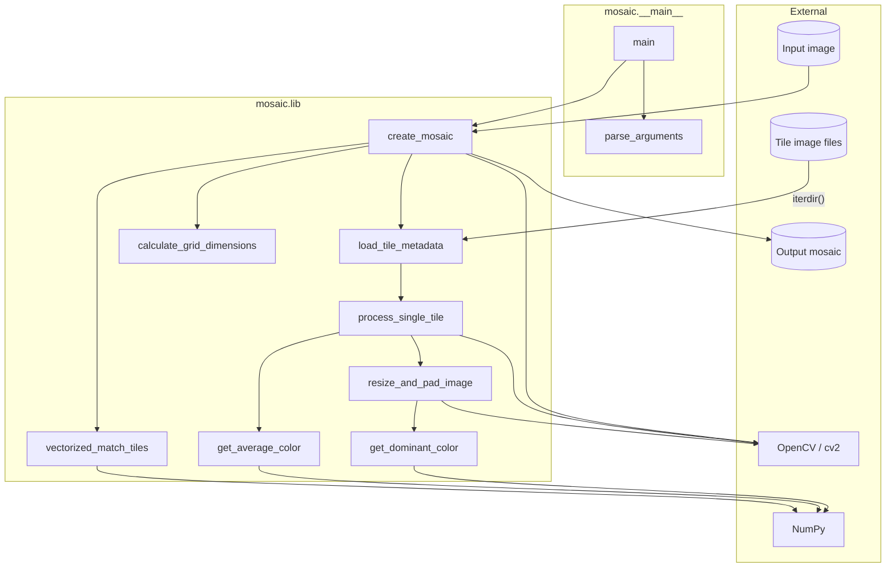
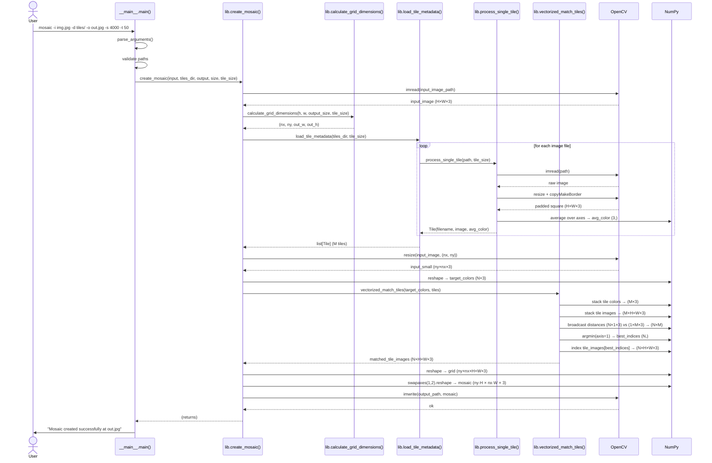

# Architecture

This document describes the architecture of the `mosaic` package: its modules,
data structures, public API, and the runtime flow of a mosaic generation run.

## Modules

| Module | Role |
| ------ | ---- |
| `mosaic/__main__.py` | CLI entry point — argument parsing, path validation, error handling |
| `mosaic/lib.py` | Core library — all image processing and mosaic assembly logic |
| `mosaic/__init__.py` | Package surface — re-exports the public API of `lib.py` |

## Data Structures

### `Tile` (frozen dataclass — `lib.py`)

Immutable record produced once per source image during tile loading. Both NumPy
arrays are marked read-only in `__post_init__` to enforce the frozen contract at
the data level.

| Field | Type | Description |
| ----- | ---- | ----------- |
| `filename` | `str` | Base name of the source file |
| `image` | `np.ndarray` `(H, W, 3)` uint8 | Resized and padded square tile, BGR |
| `average_color` | `np.ndarray` `(3,)` float64 | Mean BGR colour of the processed tile |

### NumPy array shapes used at runtime

| Name | Shape | Dtype | Where produced |
| ---- | ----- | ----- | -------------- |
| `target_colors` | `(N, 3)` | float64 | `create_mosaic` — input image downscaled to grid size then flattened; N = nx × ny |
| `tile_colors` | `(M, 3)` | float64 | `vectorized_match_tiles` — stacked from all `Tile.average_color` |
| `tile_images` | `(M, H, W, 3)` | uint8 | `vectorized_match_tiles` — stacked from all `Tile.image` |
| `distances_sq` | `(N, M)` | float64 | `vectorized_match_tiles` — Redmean² distance for every target × tile pair |
| `matched_tile_images` | `(N, H, W, 3)` | uint8 | `vectorized_match_tiles` — best tile for each grid cell |
| `grid` | `(ny, nx, H, W, 3)` | uint8 | `create_mosaic` — matched images reshaped to 2-D grid |
| `mosaic` | `(ny·H, nx·W, 3)` | uint8 | `create_mosaic` — final assembled image |

## Public API (`mosaic/__init__.py`)

```text
mosaic
├── Tile                      dataclass
├── create_mosaic()           top-level orchestrator
├── load_tile_metadata()      tile loading pipeline
├── process_single_tile()     per-file load / resize / pad
├── vectorized_match_tiles()  NumPy-vectorised colour matching
├── calculate_grid_dimensions() grid layout arithmetic
├── resize_and_pad_image()    aspect-ratio resize + dominant-colour pad
├── get_average_color()       mean BGR over all pixels
└── get_dominant_color()      RMS BGR — better perceptual representation
```

## Component Diagram



## Sequence Diagram — mosaic generation



## Colour Matching — Redmean Distance

`vectorized_match_tiles` uses the **Redmean** perceptual colour distance formula
rather than plain Euclidean distance in BGR space. This gives better visual
results by weighting channels according to human colour perception:

$$
d^2 = \left(2 + \frac{\bar{r}}{256}\right)\Delta R^2
    + 4\,\Delta G^2
    + \left(2 + \frac{255 - \bar{r}}{256}\right)\Delta B^2
$$

where $\bar{r} = \frac{R_1 + R_2}{2}$.

The entire N × M distance matrix is computed in a single NumPy broadcast
operation, avoiding any Python-level loop.
