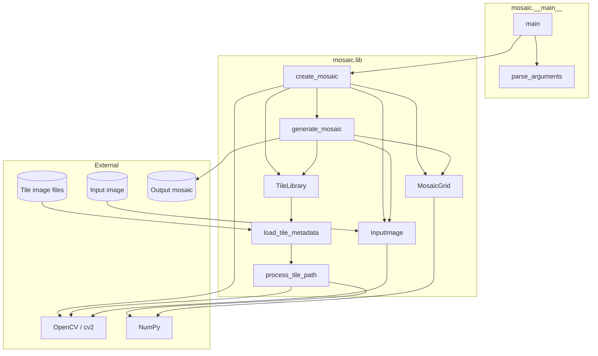
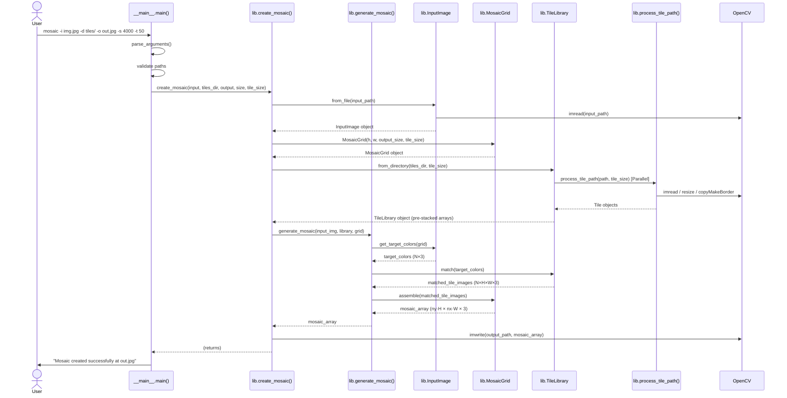

# Architecture

This document describes the architecture of the `mosaic` package: its modules,
data structures, public API, and the runtime flow of a mosaic generation run.

## Modules

| Module | Role |
| ------ | ---- |
| `mosaic/__main__.py` | CLI entry point — argument parsing, path validation, error handling |
| `mosaic/lib.py` | Core library — all image processing and mosaic assembly logic |
| `mosaic/__init__.py` | Package surface — re-exports the public API of `lib.py` |

## Data Structures

### `Tile` (frozen dataclass — `lib.py`)

Immutable record produced once per source image during tile loading. Both NumPy
arrays are marked read-only in `__post_init__` to enforce the frozen contract at
the data level.

| Field | Type | Description |
| ----- | ---- | ----------- |
| `filename` | `str` | Base name of the source file |
| `image` | `np.ndarray` `(H, W, 3)` uint8 | Resized and padded square tile, BGR |
| `average_color` | `np.ndarray` `(3,)` float64 | Mean BGR colour of the processed tile |

### Core Modules

| Name | Role | Hides |
| ---- | ---- | ----- |
| `InputImage` | Source Logic | OpenCV I/O, resizing, flattening to target colours |
| `TileLibrary` | Memory & Matching | NumPy broadcasting, pre-stacked arrays, Redmean formula |
| `MosaicGrid` | Geometry & Assembly | Grid arithmetic, axis swapping, final reshaping |
| `TileProcessor` | Image Logic | OpenCV I/O, fused pixel scans, RMS dominant colour |

## Public API (`mosaic/__init__.py`)

```text
mosaic
├── InputImage                source image and target extraction
├── Tile                      dataclass
├── TileLibrary               matching & memory management
├── MosaicGrid                layout & assembly
├── generate_mosaic()         pure core generation pipeline
├── create_mosaic()           top-level effectful shell
├── load_tile_metadata()      tile loading pipeline
└── process_tile_path()       fused image processing pass
```

## Component Diagram



## Sequence Diagram — mosaic generation



## Colour Matching — Redmean Distance

`vectorized_match_tiles` uses the **Redmean** perceptual colour distance formula
rather than plain Euclidean distance in BGR space. This gives better visual
results by weighting channels according to human colour perception:

$$
d^2 = \left(2 + \frac{\bar{r}}{256}\right)\Delta R^2
    + 4\,\Delta G^2
    + \left(2 + \frac{255 - \bar{r}}{256}\right)\Delta B^2
$$

where $\bar{r} = \frac{R_1 + R_2}{2}$.

The entire N × M distance matrix is computed in a single NumPy broadcast
operation, avoiding any Python-level loop.
